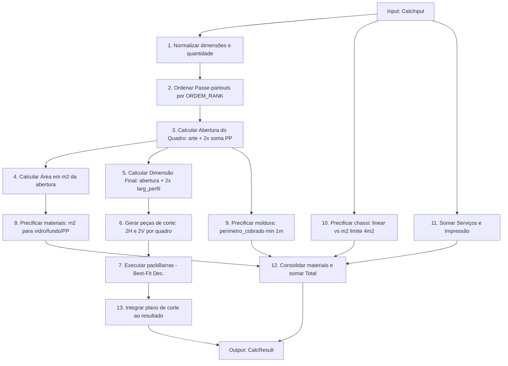

# Anatomia do calculator.ts - Engenharia Reversa e Mapa de Migração

Este documento apresenta a análise de engenharia reversa detalhada do arquivo [calculator.ts](file:///c:/Users/amand/Documents/ERB%20ARTENMOLDURAS/art-frame-hub/src/lib/calculadora/calculator.ts). O objetivo desta análise é mapear responsabilidades, dependências, fluxos e subsidiar o planejamento para a futura migração segura do código legado em direção a uma arquitetura mais modular (`Manufacturing Engine`, `Stock Engine` e `Pricing Engine`).

> [!IMPORTANT]
> Nenhuma lógica de negócio, cálculo ou comportamento foi alterado ou movido durante esta fase de documentação.

---

## 1. Mapa Completo de Funções do `calculator.ts`

### Função: `round(n: number, d = 4)`
* **Responsabilidade:** Arredonda um número decimal `n` para a precisão de `d` casas decimais, evitando problemas clássicos de ponto flutuante em JavaScript.
* **Quem chama:** 
  * `materialDePreco()` (arredondamento da quantidade total e valor total).
  * `packBarras()` (arredondamento das sobras de retalho em barras).
  * `calcular()` (diversos pontos: soma de passe-partouts, cálculo de m², acúmulo de dimensões de PPs, cálculo de peças e perímetros de molduras).
* **Quem depende dela:** Praticamente toda a engine de cálculo do arquivo.
* **Dados de entrada:** 
  * `n: number` (o valor a ser arredondado)
  * `d: number` (opcional, número de casas decimais, padrão = 4)
* **Dados de saída:** `number`
* **Efeitos colaterais:** Nenhum (função pura).

### Função: `materialDePreco(produto: Produto, origem: MaterialOrigem, quantidadeUnitaria: number, quadros: number)`
* **Responsabilidade:** Instancia o modelo `MaterialCalculado` e calcula os valores comerciais do item de acordo com a quantidade, preço unitário de venda e quantidade de quadros.
* **Quem chama:** `calcular()` (durante a montagem da lista final de materiais do orçamento).
* **Quem depende dela:** `calcular()`.
* **Dados de entrada:**
  * `produto: Produto` (entidade contendo ID, código, nome e preço de venda).
  * `origem: MaterialOrigem` (tipo do material, ex: `"perfil_moldura"`).
  * `quantidadeUnitaria: number` (quantidade utilizada por quadro).
  * `quadros: number` (quantidade total de quadros no orçamento).
* **Dados de saída:** `MaterialCalculado`
* **Efeitos colaterais:** Nenhum (função pura).

### Função: `packBarras(pecasOriginais: number[], barraCm: number)`
* **Responsabilidade:** Otimiza a distribuição de peças lineares de molduras em barras físicas disponíveis (tamanho `barraCm`), minimizando a quantidade de barras compradas/utilizadas. Implementa a heurística do algoritmo *Best-Fit Decreasing* (ordena as peças em ordem decrescente e busca a barra ativa com a menor sobra positiva compatível).
* **Quem chama:** `calcular()` (durante o processamento do perfil de moldura).
* **Quem depende dela:** `calcular()`.
* **Dados de entrada:**
  * `pecasOriginais: number[]` (lista de comprimentos de corte necessários, em cm).
  * `barraCm: number` (comprimento padrão de uma barra física, ex: 270cm).
* **Dados de saída:** `{ barras: BarraDistribuicao[]; excede: boolean }`
* **Efeitos colaterais:** Nenhum (função pura).

### Função: `calcular(input: CalcInput)`
* **Responsabilidade:** Função principal e único ponto de entrada exportado. Orquestra todo o fluxo de processamento:
  1. Normalização de dados (quantidade mínima, dimensões e tamanho da barra).
  2. Ordenação e acúmulo de dimensões de múltiplos Passe-partouts.
  3. Calcular a abertura real do quadro (arte + passe-partouts).
  4. Dimensionar e calcular peças físicas da moldura (2 horizontais e 2 verticais por quadro).
  5. Chamar o algoritmo de empacotamento linear (`packBarras`).
  6. Converter todas as partes selecionadas (moldura, PPs, proteção, fundo, impressão, chassi, serviços) em objetos comerciais `MaterialCalculado`.
  7. Consolidar os valores totais e valor unitário.
* **Quem chama:** `ProductionPipeline.process(input)` em [ProductionPipeline.ts](file:///c:/Users/amand/Documents/ERB%20ARTENMOLDURAS/art-frame-hub/src/lib/production/ProductionPipeline.ts).
* **Quem depende dela:** `ProductionPipeline` e o componente [Calculadora.tsx](file:///c:/Users/amand/Documents/ERB%20ARTENMOLDURAS/art-frame-hub/src/components/calculadora/Calculadora.tsx).
* **Dados de entrada:** `input: CalcInput`
* **Dados de saída:** `CalcResult`
* **Efeitos colaterais:** Nenhum (função pura).

---

## 2. Responsabilidades por Categoria

Esta seção divide as lógicas e cálculos internos de `calculator.ts` em cinco categorias de domínio:

```
┌────────────────────────────────────────────────────────┐
│                      CALCULATOR                        │
└───────────────────────────┬────────────────────────────┘
                            │
      ┌──────────────┬──────┴───────┬──────────────┐
      ▼              ▼              ▼              ▼
 ┌──────────┐  ┌──────────┐   ┌───────────┐  ┌───────────┐
 │Comercial │  │Produção  │   │ Engenharia│  │ Estoque   │
 └──────────┘  └──────────┘   └───────────┘  └───────────┘
```

### Comercial
* **Preço Comercial de Moldura:** Usa o perímetro comercial linear da abertura, com uma regra de mínimo de 1 metro cobrado (`Math.max(perimetro, 1)`).
* **Preço de Insumos Planos (Vidro/Fundo/Passe-partout):** Usa a área da abertura calculada em metros quadrados ($m^2$).
* **Preço de Impressão:** Baseia-se exclusivamente na área da arte original (não a abertura final) e multiplica pelo preço unitário de venda.
* **Preço do Chassi:** Regra híbrida baseada em limite físico ($4m^2$):
  * Se a área $\le 4m^2$: cobra linearmente baseando-se no perímetro da arte.
  * Se a área $> 4m^2$: cobra pela área total em $m^2$ multiplicada por `preco_venda_acima_m2`.
* **Serviços:** Adiciona o custo fixo de cada serviço selecionado.
* **Consolidação Financeira:** Agrupamento e soma de valores totais e determinação do preço unitário.

### Produção
* **Cálculo da Abertura:** Determina a largura/altura da abertura aplicando a soma dos passe-partouts aplicados sobre a arte:
  $$\text{abertura} = \text{arte} + (2 \times \sum \text{Passe-partouts})$$
* **Dimensão Final do Quadro:** Determina a dimensão física externa do quadro somando duas vezes a largura do perfil da moldura à abertura:
  $$\text{final} = \text{abertura} + (2 \times \text{largura perfil})$$
* **Geração de Peças de Corte:** Para cada quadro, a produção necessita de exatamente $2 \times \text{pecaHorizontal}$ e $2 \times \text{pecaVertical}$. O cálculo das dimensões das peças considera a abertura e a largura do perfil:
  $$\text{peca} = \text{abertura} + (2 \times \text{largura perfil})$$

### Materiais
* **Insumos Mapeados:** Associa os dados cadastrais (ID, código, nome, preço de venda e unidade de medida) das entidades do banco aos cálculos de consumo, gerando a lista de `MaterialCalculado` sob a flag `origem`.

### Engenharia
* **Algoritmo de Otimização (packBarras):** Algoritmo heurístico *Best-Fit Decreasing* para corte linear de barras, minimizando o desperdício físico e prevendo sobras.
* **Regras de Excedente Físico:**
  * Sinaliza se uma peça de corte excede o tamanho físico de uma barra (`peca_excede_barra`).
  * Sinaliza se as dimensões físicas da abertura do passe-partout excedem o tamanho máximo da chapa padrão disponível (`abertura > 100cm` ou `abertura > 80cm`).

### Estoque
* **Consumo Físico de Barras:** Calcula a quantidade inteira de barras necessárias para produzir os perfis de moldura (`total_barras`), servindo de entrada para baixas no estoque de molduras.
* **Consumo Físico de Área:** Determina a área de chapas de vidro, fundo ou passe-partout que serão consumidas física e comercialmente.

---

## 3. Matriz de Destino da Futura Migração

A tabela abaixo descreve o mapeamento ideal das responsabilidades extraídas do `calculator.ts` para os futuros subsistemas.

| Responsabilidade | Função/Trecho Legado | Arquivo Atual | Futuro Módulo Destino |
| :--- | :--- | :--- | :--- |
| **Arredondamento matemático** | `round()` | `calculator.ts` | Shared Helper / Math Utilities |
| **Otimização de corte linear (Best-Fit)** | `packBarras()` | `calculator.ts` | **Manufacturing Engine** |
| **Geração de peças de produção** | `calcular()` (L135-146) | `calculator.ts` | **Manufacturing Engine** |
| **Dimensionamento físico do quadro** | `calcular()` (L106-133) | `calculator.ts` | **Manufacturing Engine** |
| **Cálculo de consumo real de estoque** | `calcular()` / `total_barras` | `calculator.ts` | **Stock Engine** |
| **Validação de limites de chapas/barras** | `calcular()` (L128, L163) | `calculator.ts` | **Manufacturing Engine** (Quality Control) |
| **Precificação de perfis de moldura** | `calcular()` (L148-149, L170-175)| `calculator.ts` | **Pricing Engine** |
| **Precificação de áreas planas** | `calcular()` (L176-185) | `calculator.ts` | **Pricing Engine** |
| **Precificação de impressão e serviços** | `calcular()` (L187-190, L216-218)| `calculator.ts` | **Pricing Engine** |
| **Precificação condicional de chassi** | `calcular()` (L194-214) | `calculator.ts` | **Pricing Engine** |

---

## 4. Responsabilidades Duplicadas e Cruzamentos

Ao analisar a fronteira dos futuros engines (`Manufacturing`, `Stock` e `Pricing`), identificamos os seguintes pontos de acoplamento e conceitos sobrepostos:

1. **Conceito de Consumo de Moldura (Comercial vs. Físico):**
   * **Preço (Comercial):** Cobra por metro linear da abertura com base em uma regra abstrata de negócio (mínimo de 1 metro linear cobrado).
   * **Produção/Estoque (Físico):** Consome barras inteiras com base no algoritmo de corte que leva em conta a largura do perfil do quadro. 
   * *Risco:* Se a precificação futura tentar calcular o custo real de produção para margem de lucro, ela precisará consultar a distribuição de corte do `Manufacturing Engine`.
2. **Dimensionamento Geométrico:**
   * Tanto a precificação de chapas (vidro, passe-partout) quanto o corte físico necessitam calcular a largura e altura da abertura ($la + 2 \times \sum PP$). Atualmente, este cálculo ocorre em um fluxo sequencial único. Separar os engines exigirá que o `Manufacturing Engine` calcule as dimensões físicas primeiro para que o `Pricing Engine` e o `Stock Engine` possam calcular o preço e o consumo de material com precisão.
3. **Cálculo de Área ($m^2$):**
   * Usado comercialmente para multiplicar pelo preço de venda do material plano e, no estoque, para deduzir m² de chapas do inventário.

---

## 5. Dependências Ocultas e Constantes Fixas (Hardcoded)

Essas definições estão embutidas no código e devem ser devidamente expostas em tabelas de configuração ou metadados de produto para evitar quebras durante a migração:

1. **Rank de Ordenação de Passe-Partouts (`ORDEM_RANK`):**
   ```typescript
   const ORDEM_RANK: Record<PasseOrdem, number> = { interno: 0, meio: 1, externo: 2 };
   ```
   Caso o usuário defina novos nomes de ordem ou não ordene, o sistema assume o peso `99` (linha 96).
2. **Dimensão Limite da Chapa de Passe-partout:**
   ```typescript
   const passe_partout_excede_chapa = aberturaL > 100 || aberturaA > 80;
   ```
   Valores `100` e `80` são estáticos (representam chapas de $100 \times 80\text{ cm}$).
3. **Comprimento Padrão da Barra de Moldura:**
   ```typescript
   const barraCm = Math.max(1, Number(input.barra_cm) || 270);
   ```
   Valor `270` é usado quando o produto ou o input não informa o tamanho da barra.
4. **Limite de Metragem de Chassi:**
   ```typescript
   const limite = Number(input.chassi.preco_venda_limite_m2 ?? 4);
   ```
   Valor limite de $4m^2$ para chaveamento entre cobrança linear e por metro quadrado.
5. **Propriedades Dinâmicas dos Produtos:**
   * `preco_venda_acima_m2` no cadastro do produto `chassi`.
   * `largura_cm` no cadastro do produto `perfil_moldura`.

---

## 6. Ordem de Execução e Fluxo Interno Legacy

O fluxo sequencial de transformações matemáticas dentro do método `calcular()` ocorre na seguinte ordem:



---

## 7. Mapa de Migração Recomendado

Para desacoplar as responsabilidades sem alterar as regras de negócio, a seguinte estratégia de migração é proposta:

| Elemento / Função | Ação Recomendada | Módulo de Destino | Justificativa |
| :--- | :--- | :--- | :--- |
| `round` | **MANTER** (Mover) | `src/lib/utils/math.ts` | Utilitário matemático genérico útil para qualquer módulo de cálculo. |
| `materialDePreco` | **DIVIDIR** | `Pricing Engine` | A estrutura de `MaterialCalculado` gerada é puramente comercial (preço unitário, total). |
| `packBarras` | **SIM** (Migrar) | `Manufacturing Engine` | Algoritmo clássico de engenharia de produção e layout de corte linear. |
| `calcular` | **DIVIDIR** | `ProductionOrchestrator` | Será substituído por um orquestrador que chama o `Manufacturing Engine` para obter dimensões e corte, repassa dados para o `Stock Engine` avaliar consumos reais e delega ao `Pricing Engine` a consolidação de custos e preços finais. |

### Ordem Ideal de Migração

1. **Fase 2.1: Criação dos Motores Isolados (Sem Alterar Fluxo Principal)**
   * Desenvolver e testar unitariamente o `Manufacturing Engine` (contendo a lógica de corte, `packBarras` e determinação de dimensões físicas).
   * Desenvolver e testar unitariamente o `Pricing Engine` (contendo as regras comerciais de molduras, m² e chassi).
2. **Fase 2.2: Criação do Orchestrator**
   * Implementar o orquestrador que centraliza as chamadas a ambos os motores.
3. **Fase 2.3: Redirecionamento da Facade**
   * Apontar o `ProductionPipeline` para o novo orquestrador, mantendo os testes integrados idênticos.

---

## 8. Riscos e Recomendações

> [!WARNING]
> **Risco de Arredondamento Cumulativo:** O uso extensivo do helper `round` com precisões padrão diferentes (casas decimais de 2 a 4) pode induzir a discrepâncias de centavos no cálculo final se a ordem das operações for alterada. Recomenda-se manter a ordem matemática exata.

> [!CAUTION]
> **Campos Opcionais de Produtos no Banco:** A lógica do chassi e molduras assume que propriedades como `largura_cm` e `preco_venda_acima_m2` existem no objeto `Produto`. A migração deve garantir validações fortes de presença desses campos.
