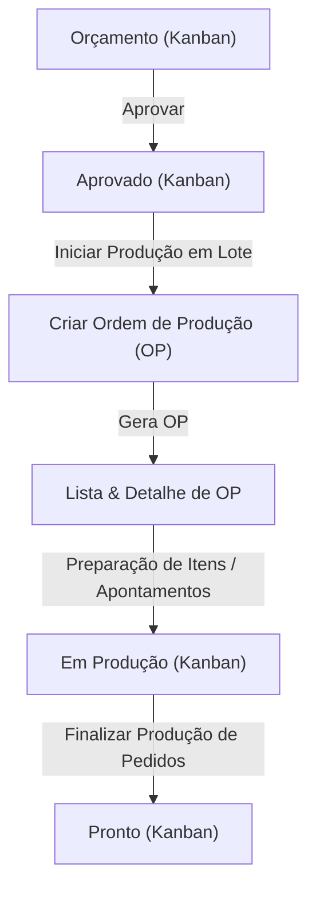

# Arquitetura da Área de Produção

Este documento consolida a arquitetura de apresentação (UI/UX), fluxos de dados, consultas (TanStack Query), RPCs (Supabase) e convenções visuais do módulo de Produção.

---

## 1. Estrutura de Rotas e Páginas

O módulo de Produção é dividido em três views principais com escopos de apresentação isolados:

```
src/routes/
├── producao.tsx                 # Layout geral contendo abas de navegação
├── producao.index.tsx           # Fluxo de Produção (Kanban de pedidos)
├── producao.ordens.tsx          # Lista de Ordens de Produção (Tabela)
└── producao.ordens.$id.tsx      # Detalhes da Ordem de Produção (Dashboard & Tabela de Itens)
```

---

## 2. Mapeamento e Invalidação de Cache (TanStack Query)

Cada view gerencia seu estado operacional a partir de uma consulta principal do React Query, cujas chaves e invalidações estão centralizadas no arquivo [production-cache.ts](file:///c:/Users/amand/Documents/ERB%20ARTENMOLDURAS/art-frame-hub/src/lib/services/production-cache.ts):

### 2.1. Centralização de Chaves (`productionKeys`)
- **`productionKeys.pedidos`**: `["pedidos"]` (Chave de listagem de pedidos/Kanban)
- **`productionKeys.ordens`**: `["ordens_producao"]` (Chave de listagem de OPs)
- **`productionKeys.ordem(id)`**: `["ordem_producao", id]` (Chave de detalhe de uma OP específica)

### 2.2. Centralizador de Invalidações (`productionCache`)
O utilitário `productionCache` centraliza e padroniza as invalidações cruzadas de cache após operações de modificação (mutations) de dados:

- **`invalidateAfterOPCreated`**: Invalida `pedidos` e `ordens`.
- **`invalidateAfterPedidoStatusChanged`**: Invalida `pedidos`.
- **`invalidateAfterOPStatusChanged`**: Invalida `ordem(id)` e `ordens`.
- **`invalidateAfterPedidoCompleted`**: Invalida `pedidos`, `ordem(id)` e `ordens`.
- **`invalidateAfterItemUpdated`**: Invalida `ordem(id)` e `ordens`.
- **`invalidateAfterPedidoRemoved`**: Invalida `pedidos`, `ordens` e `ordem(id)`.

### 2.3. Políticas de Cache Locais
As políticas de retenção e revalidação de dados foram configuradas com base no dinamismo de cada tela do módulo:

*   **Kanban (`pedidos`)**:
    *   `staleTime`: `15_000` (15 segundos) para manter transições suaves durante navegação rápida.
    *   `refetchOnWindowFocus`: `true` (Herda o global por padrão para garantir colaboração imediata multi-operador ao re-focar o sistema).
*   **Lista de OPs (`ordens_producao`)**:
    *   `staleTime`: `30_000` (30 segundos).
    *   `refetchOnWindowFocus`: `false` (Evita chamadas redundantes ao mudar de janelas).
*   **Detalhe de OP (`ordem_producao`)**:
    *   `staleTime`: `60_000` (1 minuto).
    *   `refetchOnWindowFocus`: `false` (O apontamento local e as invalidações cruzadas de mutação cuidam da consistência).

---

## 3. Fluxo Operacional de Produção

Os pedidos e ordens seguem um fluxo operacional rigoroso:



---

## 4. Catálogo de RPCs do Banco de Dados

Os serviços de produção consomem as seguintes Stored Procedures / RPCs no Supabase:

| RPC | Serviço Responsável | Objetivo |
| :--- | :--- | :--- |
| `obter_detalhe_ordem_producao` | `ordemProducaoService.get` | Retorna o payload completo da OP, itens, pedidos relacionados e histórico. |
| `criar_ordem_producao` | `ordemProducaoService.create` | Agrupa múltiplos pedidos em lote e cria uma nova OP ("aberta"). |
| `remover_pedido_da_ordem_producao` | `ordemProducaoService.removerPedido` | Remove um pedido de uma OP ativa registrando o motivo. |
| `marcar_item_preparado` | `ordemProducaoService.marcarItemPrepared` | Aponta individualmente a conclusão da preparação de um item da moldura. |
| `marcar_item_problema` | `ordemProducaoService.registrarProblemaItem` | Registra e detalha problemas ou perdas em itens específicos. |
| `concluir_pedido_producao` | `ordemProducaoService.concluirPedidoProducao` | Finaliza a produção de um pedido e atualiza o progresso da OP. |

---

## 5. Convenções de Estados de Interface (UI)

Cada página deve implementar localmente (sem novos componentes compartilhados nesta etapa) os seguintes estados para garantir resiliência e evitar Layout Shifts:

### Loading State (Skeletons)
- Usar o componente global `@/components/ui/skeleton`.
- O skeleton deve simular rigorosamente as proporções e alturas reais dos cartões, tabelas ou listas finais.
- Wrappers de loading devem conter `role="status"` e `aria-busy="true"`.

### Empty State
- Exibir mensagens amigáveis e explicativas.
- Na **Lista de Ordens**, diferenciar quando a base está vazia (`"Nenhuma ordem cadastrada"`) de quando não há resultados para filtros ativos, provendo botão para `"Limpar Filtros"`.
- No **Kanban**, manter todas as colunas visíveis exibindo `"Nenhum pedido neste status."` para preservar a percepção visual do fluxo de produção.

### Error State
- Exibir banners vermelhos com `role="alert"` utilizando `@/components/ui/alert`.
- **Erros Recuperáveis (Rede/Conexão)**: Exibir `"Não foi possível carregar os dados."` e disponibilizar um botão `"Tentar novamente"` que executa o `refetch()` correspondente da query.
- **Erro 404 (Recurso inexistente - Detalhe da OP)**: Exibir `"Ordem de Produção não encontrada."` e prover um botão de navegação destacado `"Voltar para Lista"` (sem botão de retry).
